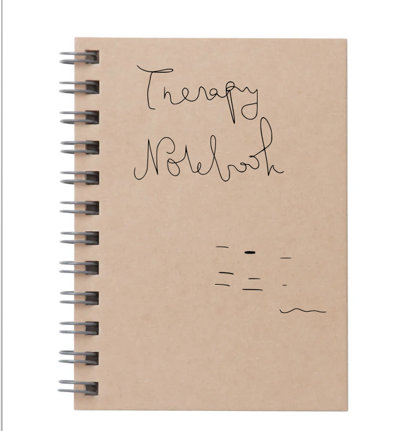

# Therapy Notebook

The __Therapy Notebook__ , is a web application designed to help patients manage and track their triggers during and between therapy sessions. It allows users to monitor their progress and make consistent behavioral changes using newly learned therapeutic techniques. The application also enables users to support other members of their group therapy sessions. This app is built to help patients, who can feel confused about their therapeutic progress and who would benefit from understanding and visualizing their progress in a more engaging and insightful way. 

## 1. Getting Started

Ling to Deployed App: 

```javascript

``` 

## 2. Attributions 

Background Pic:  https://stock.adobe.com/search?k=therapist+office+background


## 3. Technologies Used

* __Frontend__: Built using HTML, CSS, and JavaScript for a responsive and interactive user interface.
* __Backend__: Developed using Node.js and Express for server-side logic and API requests.
* __Database__:  MongoDB is used to store user data, therapy session details, and group therapy information.


## Next Step 

1. __Create a Comments Model.js__ : Develop a model that allows users to comment on each other's progress.
2. __Enhance User Interaction__: Implement features that enable users to support each other through tips and advice.
3. __Clinician Monitoring__: Allow clinicians to track their patients' progress and provide help/feedback when deemed necessary. 

